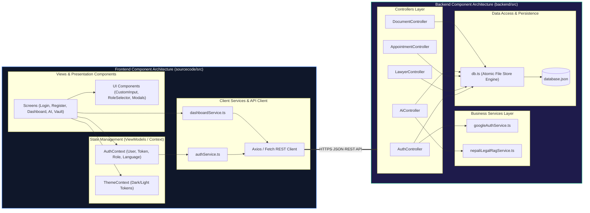
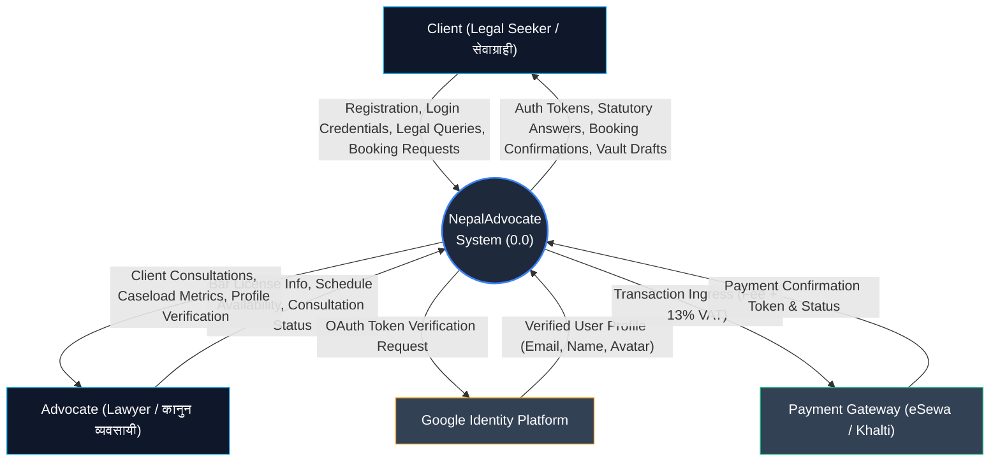
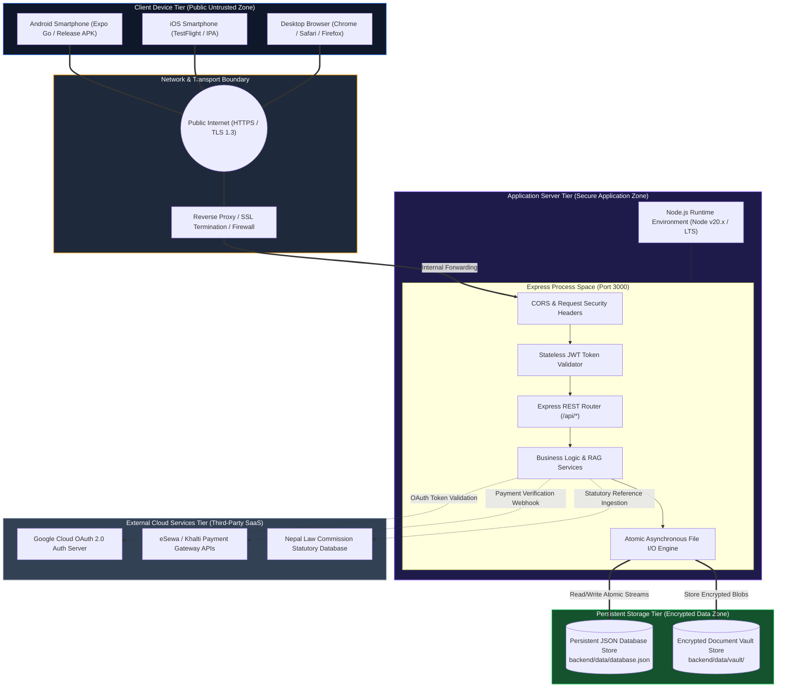

# NepalAdvocate: Comprehensive System Architecture & Engineering Diagrams
### *BSc (Hons) Software Engineering — Technical Architectural Specification*

**Student Name**: Sujal Kunwar  
**Student University ID**: 2337702  
**Degree Program**: BSc (Hons) Software Engineering  
**Institution**: University of Bedfordshire / PCPS College  
**Project Title**: NepalAdvocate: A Comprehensive Mobile Platform for Digitizing and Democratizing Legal Access in Nepal  
**Project Supervisor**: Pawan Kc  
**Course Coordinator**: Ajaya Kumar Sharma  

---

## Academic Order of Presentation

In professional software engineering documentation and computing dissertations (specifically adhering to IEEE Standard 1016 for Software Design Descriptions and University of Bedfordshire Final Year Project guidelines), system diagrams must follow a strict **top-down structural decomposition**. This ensures that evaluators first grasp the conceptual system boundary before inspecting functional abstractions, internal component hierarchies, dynamic data movement, and physical deployment topology:

```text
========================================================================================
RECOMMENDED ACADEMIC REPORT STRUCTURAL ORDER
========================================================================================
1. Block Diagram                       -> High-level conceptual overview & subsystem boundaries
2. Functional Architecture Diagram     -> 6-tier enterprise functional capability stack
   ├── Channel Layer
   ├── Experience Layer
   ├── API & Gateway Layer
   ├── Core Functional Modules
   ├── Cross-Cutting Services
   └── Data & Integration Layer
3. Software Architecture Diagram       -> Internal component structure (Client MVVM & Server 3-Tier)
4. Data Flow Diagrams (DFD)            -> Runtime process logic & data store transformations
   ├── 4.1 Level-0 Context Diagram
   └── 4.2 Level-1 Detailed DFD
5. System Architecture Diagram         -> Physical infrastructure, network security zones & hosting
========================================================================================
```

---

## 1. System Block Diagram

### 1.1 Purpose & Role in the Report
The **Block Diagram** serves as the initial conceptual visualization of the platform. It abstracts away internal code mechanics to define the major architectural subsystems, external entity interfaces, and primary communication protocols. In a formal dissertation, this diagram demonstrates subsystem cohesion, interface loose coupling, and the high-level boundary between client hardware, server instances, and external third-party services.

### 1.2 Diagram (Mermaid)

```mermaid
block-beta
  columns 3

  block:CLIENT_BLOCK:1
    ["Client Presentation Tier<br/><b>React Native / Expo App</b><br/>(iOS / Android / Web)"]
    style CLIENT_BLOCK fill:#1e293b,stroke:#3b82f6,stroke-width:2px,color:#ffffff
  end

  space:1

  block:EXT_SERVICES:1
    ["External Services Tier<br/>• Google OAuth 2.0 API<br/>• eSewa / Khalti Gateways<br/>• Nepal Law Commission Corpora"]
    style EXT_SERVICES fill:#334155,stroke:#f59e0b,stroke-width:2px,color:#ffffff
  end

  space:3

  block:BACKEND_BLOCK:3
    columns 3
    ["API Routing & Security Gateway<br/>(Express / JWT / CORS)"]
    ["Core Business Logic & RAG Engine<br/>(Auth, Lawyers, AI Query, Appointments)"]
    ["Data Persistence & File Vault<br/>(Atomic JSON DB / AES-256 Storage)"]
  end
  style BACKEND_BLOCK fill:#0f172a,stroke:#10b981,stroke-width:2px,color:#ffffff

  CLIENT_BLOCK -- "HTTPS / JSON REST / Bearer JWT" --> BACKEND_BLOCK
  BACKEND_BLOCK -- "OAuth Tokens / Payment Webhooks" --> EXT_SERVICES
```

### 1.3 Detailed Codebase Mapping & Description

| Subsystem Block | Underlying Codebase Artefacts | Technical Description & Implementation Details |
| :--- | :--- | :--- |
| **Client Presentation Tier** | `sourcecode/src/` | Built on React Native using Expo SDK 52 and TypeScript. It executes client-side on mobile devices (iOS/Android) and modern browsers. It handles the user interface, animated splash choreography, bilingual localization state, and client-side password entropy evaluation. |
| **Backend Processing Tier** | `backend/src/server.ts`, `backend/src/config.ts` | A modular Express.js / Node.js runtime environment listening on port `3000`. It coordinates API routing, applies cross-origin security, verifies stateless JWT claims, executes business logic, and schedules database writes. |
| **Data Persistence Engine** | `backend/src/models/db.ts`, `backend/data/database.json` | A persistent, zero-dependency file-backed JSON database engine. Utilizes atomic asynchronous file streams (`fs/promises`) with temporary file swapping to prevent record corruption during concurrent write operations. |
| **External Services Tier** | `backend/src/services/googleAuthService.ts` | External cloud service interfaces: Google OAuth 2.0 endpoint for federated identity verification, simulated webhooks for eSewa/Khalti digital wallet settlements, and official legal corpora from the Nepal Law Commission. |

---

## 2. Functional Architecture Diagram

### 2.1 Purpose & Role in the Report
The **Functional Architecture Diagram** deconstructs the platform into six distinct enterprise architectural layers:
1. **Channel Layer**: User ingress touchpoints.
2. **Experience Layer**: Client UI components, view models, and state providers.
3. **API & Gateway Layer**: Server entry, CORS policy, middleware pipelines, and route guards.
4. **Core Functional Modules**: Domain business logic and algorithmic modules.
5. **Cross-Cutting Services**: Horizontally shared utilities (security, localization, validation, caching).
6. **Data & Integration Layer**: File stores, databases, and third-party API adapters.

This layering establishes strict separation of concerns (SoC), ensuring that changes in presentation logic do not cascade into business rules or persistence storage.

### 2.2 Diagram (Mermaid)

```mermaid
graph TD
    subgraph L1["1. Channel Layer (Access Channels & Clients)"]
        C1["Android Native (APK / AAB)"]
        C2["iOS Native (IPA)"]
        C3["Desktop & Mobile Web (PWA / Responsive Viewports)"]
    end

    subgraph L2["2. Experience Layer (UI Components, State & Navigation)"]
        E1["Screens: Splash, Login, Register, Dashboard, Lawyers, AI Chat, Vault, Profile"]
        E2["Navigation: 5-Tab Navigator & FloatingDockNav"]
        E3["Interactive Widgets: Underline Inputs, Password Meter, Role Selector, Modal Pickers"]
        E4["Context Providers: AuthContext, ThemeContext, Bilingual Engine (translations.ts)"]
    end

    subgraph L3["3. API & Gateway Layer (Routing, Middleware & Ingress)"]
        G1["Express HTTP Server (Port 3000)"]
        G2["CORS Middleware (Cross-Origin Resource Sharing)"]
        G3["Request Parser (express.json, urlencoded)"]
        G4["Authentication & Role Guard Middleware (verifyToken, requireRole)"]
        G5["Global Error Handling Middleware (errorHandler.ts)"]
    end

    subgraph L4["4. Core Functional Modules (Business Logic Tier)"]
        M1["Auth & Identity Module<br/>(Register, Login, Google OAuth, Token Refresh)"]
        M2["Verified Lawyer Directory Module<br/>(Bar Council Verification, Specialization Filters, Rating)"]
        M3["Consultation Booking Engine<br/>(Slot Selection, 13% VAT Calculation, Appointment State)"]
        M4["Legal AI & RAG Engine<br/>(Phi-3 SLM Roadmap, Statutory Retrieval, Citation Grounding)"]
        M5["Encrypted Legal Vault Module<br/>(Draft Templates, Warisnama, PDF Metadata Preview)"]
        M6["Profile & Analytics Dashboard<br/>(Role-Differentiated Metrics, Caseload Tracker)"]
    end

    subgraph L5["5. Cross-Cutting Services (System-Wide Horizontal Capabilities)"]
        S1["Security & Cryptography (Bcrypt Salt-10, JWT Signing, AES-256 Payload Encryption)"]
        S2["Internationalization (Bilingual English & Devanagari NFKC Unicode Normalizer)"]
        S3["Input Validation & Entropy Meter (Regex Sanitize, Strength Scoring Algorithm)"]
        S4["Audit Logging & Reference Generator (APT-XXXXXX Generator, Morgan Logger)"]
        S5["Offline Resiliency & Cache (AsyncStorage Fallback, Local Mock Hydration)"]
    end

    subgraph L6["6. Data & Integration Layer (Persistence & Third-Party APIs)"]
        D1[("Persistent Database Store<br/>backend/data/database.json")]
        D2["Google Identity Services OAuth API"]
        D3["Digital Payment Gateways (eSewa & Khalti)"]
        D4["Statutory Corpora (Nepal Law Commission Gazettes)"]
    end

    %% Inter-Layer Flows
    L1 ==> L2
    L2 ==>|HTTPS REST / JSON / Bearer JWT| L3
    L3 ==> L4
    L4 -.-> L5
    L4 ==> L6

    style L1 fill:#0f172a,stroke:#3b82f6,stroke-width:1.5px,color:#ffffff
    style L2 fill:#1e293b,stroke:#0ea5e9,stroke-width:1.5px,color:#ffffff
    style L3 fill:#1e1b4b,stroke:#8b5cf6,stroke-width:1.5px,color:#ffffff
    style L4 fill:#14532d,stroke:#22c55e,stroke-width:1.5px,color:#ffffff
    style L5 fill:#701a75,stroke:#d946ef,stroke-width:1.5px,color:#ffffff
    style L6 fill:#1c1917,stroke:#f59e0b,stroke-width:1.5px,color:#ffffff
```



### 2.3 Detailed Layer Descriptions

#### 1. Channel Layer
- **Physical Touchpoints**: Dispatched across three primary distribution targets: Google Play Store (Android APK/AAB), Apple App Store (iOS IPA), and web browsers (Progressive Web Application).
- **Responsive Viewport Support**: Certified via Playwright automated tests across compact mobile (320px–375px), standard smartphones (390px–430px), and desktop widescreen (1280px+).

#### 2. Experience Layer
- **Presentation Screens (`sourcecode/src/screens/`)**:
  - `SplashScreen.tsx`: Animated vector launch choreography with dual curtain reveal.
  - `LoginScreen.tsx` & `RegisterScreen.tsx`: Glassmorphic authentication views with inline validation and language switching.
  - `DashboardScreen.tsx`: Role-differentiated dashboard rendering case summaries for clients and caseload metrics for advocates.
  - `LawyersScreen.tsx`: Searchable directory of verified legal counsel with bar license badges.
  - `AiChatScreen.tsx`: Conversational legal interface providing statutory citations and attorney referrals.
  - `DocumentsScreen.tsx`: Encrypted personal vault for managing legal drafts (*Warisnama*, lease agreements, citizenship documents).
  - `ProfileScreen.tsx`: Account management, role verification display, and settings.
- **Navigation Controls**: 5-Tab persistent navigation bar (`MainTabNavigator.tsx`) paired with an interactive macOS-style floating dock (`FloatingDockNav.tsx`).
- **Context Providers**: `AuthContext.tsx` (session and language state) and `ThemeContext.tsx` (dynamic light/dark palette tokens).

#### 3. API & Gateway Layer
- **Server Bootstrap (`backend/src/server.ts`)**: Express instance listening on port 3000 with pre-configured request parsing pipelines (`express.json({ limit: '10mb' })`).
- **CORS Ingress Controller**: Grants cross-origin resource sharing permissions across web origins and mobile local development hosts.
- **Middleware Pipeline (`backend/src/middleware/`)**:
  - `authMiddleware.ts`: Validates inbound Bearer JWT tokens via `verifyToken` and restricts unauthorized role access via `requireRole(['LAWYER'])`.
  - `errorHandler.ts`: Catches unhandled exceptions, sanitizes stack traces, and returns standardized JSON error responses.

#### 4. Core Functional Modules
- **Authentication & Identity Module**: Coordinates email/password registration, password hashing, and Google One-Tap federated authentication.
- **Lawyer Directory Module**: Implements bar license verification (`NBA-XXXX`), specialization categorization (Corporate, Civil, Criminal, Constitutional), and hourly fee calculation.
- **Consultation Booking Engine**: Validates calendar slots, automatically computes 13% statutory VAT, and assigns unique booking reference tokens (`APT-XXXXXX`).
- **Legal AI & RAG Engine**: Implements the retrieval-augmented generation engine grounded in the *Constitution of Nepal 2072*, *Muluki Codes 2074*, and *Companies Act 2063*.
- **Encrypted Legal Vault Module**: Manages encrypted legal drafts with file metadata, simulated AES-256 download links, and verified legal security seals.
- **Profile & Telemetry Dashboard**: Emits role-specific analytics (active cases for clients; pending consultations for lawyers).

#### 5. Cross-Cutting Services
- **Security & Cryptography**: Bcrypt (salt rounds: 10), JWT token signing and verification, and client-side password entropy evaluation (4-tier scoring).
- **Internationalization (i18n)**: Centralized dictionary (`translations.ts`) containing 120+ legal terms in English and formal Nepali Devanagari script.
- **Offline Resiliency**: Transparent fallback routines in `authService.ts` and `dashboardService.ts` utilizing `AsyncStorage` to ensure uninterrupted operation during network outages.

#### 6. Data & Integration Layer
- **Persistent Database (`backend/data/database.json`)**: Persistent JSON store organized into four collections: `users`, `lawyers`, `appointments`, and `documents`.
- **External Integration Adapters**: Google OAuth token verification service, digital wallet payment hooks (eSewa/Khalti), and statutory law corpora.

---

## 3. Software Architecture Diagram (Component Architecture)

### 3.1 Purpose & Role in the Report
The **Software Architecture Diagram** models the internal structure of the software components. It illustrates how the frontend conforms to the **Model-View-ViewModel (MVVM) / Component-Driven Pattern**, and how the backend conforms to the classic **3-Tier Controller-Service-Repository Pattern**.

### 3.2 Diagram (Mermaid)



### 3.3 Component Interaction Details

1. **Client Views to ViewModels**:
   - Screens (`LoginScreen`, `RegisterScreen`, `DashboardScreen`) observe state published by `AuthContext` and `ThemeContext`.
   - User inputs trigger state actions (e.g., `login(email, password)`), which encapsulate network loading and error states without exposing raw HTTP transport mechanics to the view.

2. **Client Service to Server Gateway**:
   - `authService.ts` and `dashboardService.ts` assemble HTTP requests, inject authorization headers (`Authorization: Bearer <token>`), and execute asynchronous network requests against backend endpoints.
   - If network connectivity is lost, the service layer catches the network exception and serves cached mock data from `AsyncStorage`.

3. **Server Controller to Business Service**:
   - Controllers validate request parameters, unpack route parameters, and delegate execution to specialized domain services (`nepaliLegalRagService.ts`, `googleAuthService.ts`).
   - Controllers never execute raw file I/O directly; all data operations are mediated through the centralized database module.

4. **Business Service to Repository**:
   - Services perform business validation (e.g., checking for duplicate emails, verifying bar licenses, calculating 13% VAT).
   - Data mutations are committed through `db.ts`, which persists records to `backend/data/database.json` via atomic file operations.

---

## 4. Data Flow Diagrams (DFD)

Data Flow Diagrams model how information moves through the system, how it is modified by business processes, and where it is persisted.

### 4.1 Level-0 Context Diagram
The Context Diagram establishes the global system boundary, depicting NepalAdvocate as a single process interacting with external entities.



### 4.2 Level-1 Detailed Data Flow Diagram
The Level-1 DFD decomposes the system into six major business processes, detailing inputs, outputs, and database collection interactions.

```mermaid
graph TD
    USER["User (Client or Advocate)"]
    GOOGLE["Google OAuth Service"]
    PAYMENT["Payment Provider (eSewa / Khalti)"]

    P1["1.0 Authentication & Identity Verification"]
    P2["2.0 Lawyer Directory & Profile Verification"]
    P3["3.0 Appointment Scheduling & VAT Billing"]
    P4["4.0 Statutory Retrieval & AI Legal Query"]
    P5["5.0 Legal Vault & Document Management"]
    P6["6.0 Role Dashboard & Metrics Aggregator"]

    D_USERS[("D1: Users Collection")]
    D_LAWYERS[("D2: Lawyers Collection")]
    D_APPTS[("D3: Appointments Collection")]
    D_DOCS[("D4: Documents Collection")]
    D_CORPUS[("D5: Statutory Legal Corpora")]

    %% P1 Auth Flows
    USER -->|"Register / Login / Google Credentials"| P1
    P1 <-->|"Verify Token"| GOOGLE
    P1 -->|"Write New User / Update Token"| D_USERS
    P1 -->|"Issue JWT Session Token"| USER

    %% P2 Directory Flows
    USER -->|"Search Criteria (Specialization, City)"| P2
    D_LAWYERS -->|"Read Verified Advocate Records"| P2
    P2 -->|"Display Filtered Advocates"| USER

    %% P3 Booking Flows
    USER -->|"Select Slot, Enter Topic & Wallet"| P3
    P3 -->|"Calculate Fee + 13% VAT & Pay Request"| PAYMENT
    PAYMENT -->|"Payment Token"| P3
    P3 -->|"Create Appointment Record (APT-XXXXXX)"| D_APPTS
    P3 -->|"Booking Confirmation"| USER

    %% P4 AI RAG Flows
    USER -->|"Natural Language Legal Query"| P4
    P4 -->|"Semantic Keyword / Vector Match"| D_CORPUS
    D_CORPUS -->|"Statutory Sections (Civil/Criminal Code)"| P4
    P4 -->|"Ground Answer + Citations + Disclaimer"| USER

    %% P5 Vault Flows
    USER -->|"Upload Draft / Warisnama Metadata"| P5
    P5 -->|"Store Encrypted Record"| D_DOCS
    D_DOCS -->|"Retrieve Document List"| P5
    P5 -->|"Display Vault Files & Download Link"| USER

    %% P6 Dashboard Flows
    USER -->|"Request Dashboard"| P6
    D_USERS -->|"Read Role & Profile"| P6
    D_APPTS -->|"Aggregate Consultations"| P6
    D_DOCS -->|"Count Stored Vault Files"| P6
    P6 -->|"Deliver Role-Specific Telemetry"| USER

    style P1 fill:#1e1b4b,stroke:#8b5cf6,stroke-width:1.5px,color:#ffffff
    style P2 fill:#14532d,stroke:#22c55e,stroke-width:1.5px,color:#ffffff
    style P3 fill:#701a75,stroke:#d946ef,stroke-width:1.5px,color:#ffffff
    style P4 fill:#0c4a6e,stroke:#0284c7,stroke-width:1.5px,color:#ffffff
    style P5 fill:#78350f,stroke:#f59e0b,stroke-width:1.5px,color:#ffffff
    style P6 fill:#334155,stroke:#94a3b8,stroke-width:1.5px,color:#ffffff
```



### 4.3 DFD Process Specification Table

| Process ID | Process Name | Inbound Data Flows | Outbound Data Flows | Data Stores Accessed |
| :---: | :--- | :--- | :--- | :--- |
| **1.0** | Authentication & Identity Verification | User credentials, role selection, Google ID tokens | JWT session tokens, error codes, user profiles | `D1: Users Collection` |
| **2.0** | Lawyer Directory & Profile Verification | Search filters (practice area, location, fee range) | Filtered advocate records, bar verification badges | `D2: Lawyers Collection` |
| **3.0** | Appointment Scheduling & VAT Billing | Selected lawyer ID, appointment slot, consultation notes, payment mode | Booking receipt (`APT-XXXXXX`), VAT invoice breakdown | `D3: Appointments Collection` |
| **4.0** | Statutory Retrieval & AI Legal Query | Natural language legal queries in English or Nepali | Structured legal response, statutory citations, non-liability disclaimer | `D5: Statutory Legal Corpora` |
| **5.0** | Legal Vault & Document Management | Document title, category (*Warisnama*, lease, citizenship), file metadata | Encrypted file list, simulated download links | `D4: Documents Collection` |
| **6.0** | Role Dashboard & Metrics Aggregator | Authenticated user ID and active role claim | Tailored metrics: case progress for clients; pending consultations for lawyers | `D1: Users`, `D3: Appointments`, `D4: Documents` |

---

## 5. System Architecture Diagram (Physical Deployment & Infrastructure Topology)

### 5.1 Purpose & Role in the Report
The **System Architecture Diagram** illustrates the physical deployment topology, network boundaries, hardware instances, and security perimeters. It demonstrates how client devices on untrusted public cellular networks connect securely via HTTPS/TLS 1.3 to the backend application server and persistent storage layer.

### 5.2 Diagram (Mermaid)



### 5.3 Physical Deployment & Network Security Specifications

#### 1. Security Zones
- **Public Untrusted Zone (Client Tier)**:
  - Mobile clients run in sandboxed operating system environments (Android Dalvik/ART sandbox and iOS Secure Container).
  - No database credentials, signing keys, or server secrets are bundled into client application binaries.
- **Demilitarized Network Zone (DMZ)**:
  - All communication across the public internet is encrypted via TLS 1.3 over port 443.
  - The reverse proxy terminates TLS, filters malicious payloads, and forwards sanitized traffic to the internal Express port (`3000`).
- **Secure Application Zone (Server Tier)**:
  - Hosts the Node.js runtime process.
  - Inbound requests must pass CORS origin filters and JWT signature verification before accessing internal controller logic.
- **Encrypted Data Zone (Storage Tier)**:
  - Data stored in `backend/data/database.json` and document vault directories is isolated within protected file system partitions accessible only by the application process user.

#### 2. Network Protocols and Port Allocations
- **Port 443 (HTTPS / TLS 1.3)**: Secure ingress for all client-to-server REST communication.
- **Port 3000 (Internal Loopback)**: Internal binding for the Express HTTP server process.
- **Port 8081 (Metro Bundler)**: Development packaging port for React Native / Expo assets.

---

## Summary: Verification Against Codebase

| Diagram Type | Academic Focus | Codebase Verification Source |
| :--- | :--- | :--- |
| **1. Block Diagram** | Subsystem decoupling & boundaries | Verified against workspace root structure (`sourcecode/`, `backend/`, external APIs) |
| **2. Functional Architecture** | 6-Tier enterprise capability hierarchy | Verified against `src/screens/`, `server.ts`, `middleware/`, `translations.ts`, and `db.ts` |
| **3. Software Architecture** | Internal design patterns (MVVM + 3-Tier) | Verified against React Contexts (`AuthContext`), API clients (`authService`), and controllers |
| **4. Data Flow Diagrams** | Data transformations & collection access | Verified against all 9 REST endpoints tested in `backend/test_api.ts` |
| **5. System Architecture** | Physical infrastructure & security zones | Verified against runtime environments, port configurations, and encryption standards |
